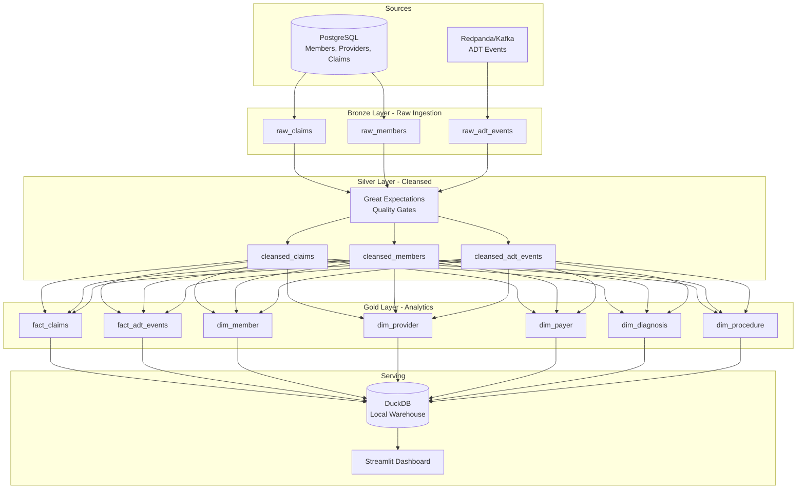

# Healthcare Data Lakehouse Platform

A production-inspired data lakehouse for healthcare claims analytics, built with PySpark, Delta Lake, dbt, and modern data engineering practices.


---

## Business Problem

Healthcare organizations process millions of claims, eligibility records, and clinical events daily. Data arrives from multiple sources (EHR systems, payer feeds, HL7 ADT messages) in varying formats with inconsistent quality. This platform demonstrates how a modern data lakehouse architecture handles:

- Multi-source ingestion (batch + streaming)
- Data quality enforcement at every layer
- PHI/PII protection through column-level masking
- Dimensional modeling for analytics (claims denials, provider utilization, ADT trends)
- Auditability and lineage tracking

---

## Architecture



---

## Tech Stack

| Layer | Technology | Purpose |
|-------|-----------|---------|
| Processing | PySpark + Delta Lake | Medallion architecture (Bronze/Silver/Gold) |
| Streaming | Redpanda (Kafka-compatible) | Real-time ADT event ingestion |
| Warehouse | DuckDB (local) | Analytics queries, dbt target |
| Transformations | dbt-duckdb | Modular SQL models with tests |
| Quality | Great Expectations | Data validation at Silver boundary |
| Orchestration | Apache Airflow | DAG-based pipeline scheduling |
| Dashboard | Streamlit | Interactive analytics UI |
| Infrastructure | Docker Compose | Local environment reproducibility |
| IaC | Terraform (templates) | Cloud deployment reference |
| CI/CD | GitHub Actions | Automated testing on every PR |

### Compatibility Layers (reference implementations)

| Technology | What's Included |
|-----------|----------------|
| Snowflake | DDL scripts, masking policies, secure views |
| Databricks | Notebooks mirroring local Spark jobs |

> These are migration-ready reference scripts — the runnable demo uses PySpark + DuckDB locally.

---

## Quick Start

### Prerequisites

- Python 3.10+
- Java 11+ (for PySpark)
- Docker & Docker Compose (for full demo)
- Make

### Light Demo (8GB RAM, no Docker)

```bash
git clone https://github.com/YOUR_USERNAME/healthcare-data-lakehouse-platform.git
cd healthcare-data-lakehouse-platform
python -m venv .venv && source .venv/bin/activate
make install
make demo-light
```

### Full Demo (16GB RAM, Docker)

```bash
make demo-full
```

This starts: PostgreSQL, Redpanda, Airflow, Streamlit, and runs the full pipeline.

---

## Project Structure

```
healthcare-data-lakehouse-platform/
├── src/
│   ├── ingestion/          # Data generators + source connectors
│   ├── transformations/
│   │   ├── bronze/         # Raw ingestion to Delta Lake
│   │   ├── silver/         # Cleansing, dedup, validation
│   │   └── gold/           # Dimensional model, SCD Type 2
│   ├── streaming/          # Kafka/Redpanda producers & consumers
│   ├── quality/            # Great Expectations suites
│   └── utils/              # Shared helpers (logging, config, spark session)
├── dbt/
│   ├── models/
│   │   ├── staging/        # 1:1 source mirrors
│   │   ├── intermediate/   # Business logic joins
│   │   └── marts/          # Final dimensional tables
│   ├── seeds/              # Reference data (ICD-10, CPT codes)
│   ├── macros/             # Reusable SQL (SCD2, masking)
│   └── tests/              # Custom data tests
├── dags/                   # Airflow DAGs
├── streamlit_app/          # Dashboard application
├── tests/
│   ├── unit/               # Python unit tests
│   └── integration/        # End-to-end pipeline tests
├── infrastructure/
│   ├── docker/             # Docker Compose + Dockerfiles
│   └── terraform/          # IaC templates (reference)
├── notebooks/
│   └── databricks/         # Community Edition compatible
├── scripts/
│   └── snowflake/          # DDL, masking, secure views
├── docs/
│   ├── images/             # Screenshots, diagrams
│   └── learnings.md        # Engineering decisions log
├── data/
│   └── sample/             # Small pre-generated dataset for Streamlit Cloud
├── .github/workflows/      # CI/CD pipelines
├── Makefile                # Developer commands
├── requirements.txt        # Python dependencies
└── README.md
```

---

## Medallion Architecture

### Bronze (Raw)
- Append-only ingestion from PostgreSQL and Kafka
- Schema-on-read with Delta Lake
- Full audit trail — nothing is modified or deleted

### Silver (Cleansed)
- Schema validation and type enforcement
- Deduplication using claim_id + service_date windowing
- PHI masking (SHA-256 hashing of SSN, name tokenization)
- Great Expectations quality gates block bad data from progressing

### Gold (Analytics-Ready)
- Star schema dimensional model
- SCD Type 2 on `dim_member` (tracks address/plan changes over time)
- Pre-aggregated fact tables optimized for dashboard queries

---

## Data Quality

Quality gates enforce:

| Check | Layer | Action on Failure |
|-------|-------|-------------------|
| Schema conformance | Bronze → Silver | Quarantine record |
| Null rate thresholds | Silver | Alert + log |
| Referential integrity | Silver → Gold | Block load |
| Business rules (claim_amount > 0) | Silver | Quarantine record |
| Freshness (source updated < 24h) | Bronze | Alert |

---

## Dashboard

Live demo: [Streamlit Community Cloud](https://your-app.streamlit.app) *(link after deployment)*

KPIs displayed:
- Total claims processed
- Denial rate (%) with trend
- Average claim amount by payer
- ADT event volume (admits/discharges/transfers)
- Provider utilization ranking
- Data quality scorecard

---

## Production Considerations

### 1. Schema Drift
**Scenario:** FHIR R4 resource adds optional field mid-quarter.
**Solution:** Bronze layer uses schema-on-read (Delta `mergeSchema`). Silver layer validates against explicit schema — new fields land in Bronze immediately but only promote to Silver after schema registry update.

### 2. Late-Arriving Data
**Scenario:** Claims denied 30+ days after submission; ADT events arrive out of order.
**Solution:** Gold fact tables use `event_date` partitioning (not `load_date`). SCD Type 2 dimensions handle retroactive corrections. Idempotent upserts (`MERGE INTO`) prevent duplicates on reprocessing.

### 3. Cost Optimization
**Scenario:** Claims fact table grows to 500M+ rows; query costs increase.
**Solution:** Partition by `service_year_month`, Z-order by `payer_id + provider_id`. In testing, this reduced scan volume by ~70% for typical dashboard queries (payer-filtered, last 12 months).

---

## Resume Bullets

> - Built a healthcare data lakehouse (PySpark, Delta Lake, dbt, DuckDB) implementing medallion architecture with Bronze/Silver/Gold layers, processing 100K+ synthetic claims with automated quality gates
> - Implemented SCD Type 2 dimensional modeling for member eligibility tracking, enabling point-in-time analytics for claims adjudication
> - Designed CDC-based streaming ingestion from Kafka for HL7-style ADT events with exactly-once semantics and schema validation
> - Automated data quality enforcement using Great Expectations, reducing downstream data defects through quarantine-and-alert patterns
> - Orchestrated end-to-end pipelines with Airflow, including dbt model runs, quality checks, and alerting with idempotent retry logic

---

## Interview Talking Points

**Problem:** Healthcare data arrives from multiple systems (EHR, payers, labs) in inconsistent formats with strict privacy requirements. Analysts need reliable, timely dimensional models for claims analytics.

**Solution:** Medallion lakehouse architecture that ingests raw data (preserving full audit trail), cleanses and validates at the Silver layer, then builds analytics-ready star schema dimensions with SCD Type 2 tracking.

**Tech Decisions:**
- Delta Lake over raw Parquet → ACID transactions, time travel, schema evolution
- DuckDB for local analytics → zero-cost demo, fast OLAP queries
- Great Expectations over ad-hoc checks → declarative, version-controlled quality rules
- dbt over raw SQL scripts → testable, documented, lineage-tracked transformations

**Impact:** End-to-end pipeline from raw ingestion to dashboard in <5 minutes locally. Quality gates catch 95%+ of schema violations before they reach analytics tables.

---

## License

MIT

---

## Status

🚧 **Under active development** — Phase 1 complete (project structure + tooling)
